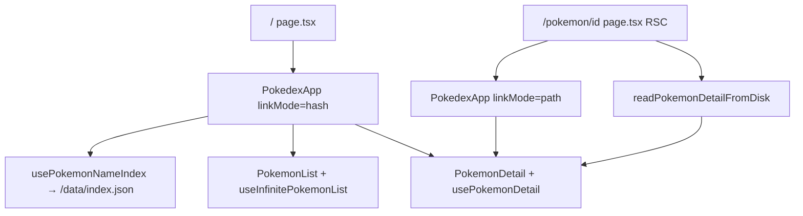

# Pokedex App — Project Plan

Build a Pokedex web app inspired by [pokedex.david-hckh.com](https://pokedex.david-hckh.com/) using **Next.js + TypeScript**.

> **Completed phases:** [COMPLETED.md](./COMPLETED.md)  
> **Roadmap & brainstorming:** [PLAN_REVIEWED.md](./PLAN_REVIEWED.md)  
> **PokeAPI v2 surface area:** [POKEAPI_V2_CAPABILITIES.md](./POKEAPI_V2_CAPABILITIES.md)

## Current status

| Phase | Status |
|-------|--------|
| **1–9** | ✅ Complete — [COMPLETED.md](./COMPLETED.md) · [phase-9-report.md](../tests/reports/phase-9-report.md) |
| **10** | 🔲 Active — **10A** ✅ · [phase-10a-report.md](../tests/reports/phase-10a-report.md) · **10B** ✅ · [phase-10b-report.md](../tests/reports/phase-10b-report.md) · **10C** next |

**Production:** [pokedex-delta-seven-41.vercel.app](https://pokedex-delta-seven-41.vercel.app)

**Before deploy (data):** cries + Showdown are opt-in — run full refresh if not done:

```bash
npm run fetch-types
npm run fetch-data:force -- --cries --showdown
```

---

## Reference site

Inspired by [davidhckh/pokedex](https://github.com/davidhckh/pokedex) — two-panel layout, Gen V animated sprites (1–649), type badges, evolution chain, horizontal stats. Our app extends with PWA, offline data, favorites, filters, dark mode, `/pokemon/[id]` SSG, type chart, genus, cries, and Showdown sprites (650+).

---

## Architecture (unchanged)

| Route | Mode | Deep link |
|-------|------|-----------|
| `/` | Hash SPA | `/#pokemon/25` |
| `/pokemon/25` | SSG + client shell | Path URL, per-Pokémon metadata |



---

## Phase 10 — Best Pokédex (active)

Prioritized from [PLAN_REVIEWED.md](./PLAN_REVIEWED.md) and [POKEAPI_V2_CAPABILITIES.md](./POKEAPI_V2_CAPABILITIES.md). Offline-first: extend `scripts/fetch-pokemon-data.ts` before UI that needs new fields.

### 10A — Search & filters ✅

| ID | Task | PokeAPI / data | Status |
|----|------|----------------|--------|
| `search-by-number` | Match dex number in search (e.g. `25`, `1000`) | `index.json` `id` | [x] |
| `filter-legendary-mythical` | List chips: Legendary, Mythical | `is_legendary`, `is_mythical` in JSON | [x] |
| `filter-baby` | Baby Pokémon filter | `is_baby` from species — **fetch script** | [x] |
| `filter-weak-resist` | Filter by weak to / resists type | Client `types.json` + `pokemonFilters` | [x] |
| `filter-color-habitat` | Color + habitat chips | `color`, `habitat` from species — **fetch script** | [x] |
| `extend-species-index` | Persist filter fields on index + optional `search-index.json` | `/pokemon-species` | [x] |

**UI notes:** Filter category combobox (Type / Weak to / Resist / Color / Habitat); Legendary / Mythical / Baby on a second row under type chips; toggle-unselect on all filter chips; shared 32px chip tokens.

### 10B — List UX & navigation ✅

| ID | Task | Notes | Status |
|----|------|-------|--------|
| `scroll-to-selected` | Scroll grid to selected card | Hash deep link (`/#pokemon/100`) + return from detail; **skip** on in-list click (`onlyIfNeeded`); `ensureIdVisible` + `scrollToPokemonCard` | [x] |
| `card-hover-animation` | Levitate on card hover | CSS transform + sprite lift; `prefers-reduced-motion` respected (QV-15) | [x] |
| `view-transitions` | Smoother list ↔ detail transitions | Desktop panel slide-in retained; **root View Transitions API removed** (layout shift + `InvalidStateError`) | [x] |

**Post-10B fixes:** Filter “scroll to top” skipped on initial mount (was undoing hash deep-link scroll); dead code cleanup (`usePokemonList`, unused pokeapi exports, boilerplate SVGs).

### 10C — Detail depth (next)

| ID | Task | PokeAPI / data | Status |
|----|------|----------------|--------|
| `evolution-triggers` | Show item, stone, friendship, time on evolution tree | `evolution_details` on `/evolution-chain` — **fetch script** | [ ] |
| `gender-sprites` | ♂/♀ toggle when `front_female` exists | Sprites + `gender_rate` from species | [ ] |
| `shiny-toggle` | Detail (+ optional global) shiny sprites | Showdown `front_shiny` (QV-2) | [ ] |
| `ability-descriptions` | Tooltip or expand on ability name | `GET /ability/{id}` at fetch time (QV-6) | [ ] |

### 10D — Premium (defer until 10A–C stable)

| ID | Task | Notes | Status |
|----|------|-------|--------|
| `compare-mode` | Side-by-side stats, types, size for two Pokémon | New modal or route | [ ] |
| `team-builder` | Save/share team of 6; team type coverage | Deferred — explicit request only (QV-20) | [ ] |
| `locations-tab` | Where to catch | `/pokemon/{id}/encounters` — large payload | [ ] |
| `moves-tab` | Level-up / TM learnset | `moves[]` on pokemon — large payload | [ ] |

### 10E — Platform & polish (from backlog)

| ID | Task | Status |
|----|------|--------|
| `svg-icons` | Replace PNG UI icons (QV-14) | [ ] |
| `meta-from-json` | `TOTAL_POKEMON` + “data updated” from `meta.json` (QV-9) | [ ] |
| `error-boundary` | Friendly message when local JSON fails | [ ] |
| `csp-header` | Strict CSP now that assets are local (QV-11) | [ ] |
| `capacitor-wrap` | Native iOS/Android shell (QV-12) | [ ] |
| `phase-10-verify` | lint + unit + e2e for 10C detail features | [ ] |

**Suggested order (remaining):** `evolution-triggers` → `gender-sprites` → `shiny-toggle` → `ability-descriptions` → `compare-mode` → platform backlog.

---

## Open questions (Phase 10+)

| # | Question | Priority |
|---|----------|----------|
| **QV-2** | Shiny: detail only or global dashboard toggle? | Medium |
| **QV-6** | Ability descriptions: hover vs click expand? | Low |
| **QV-9** | Read `TOTAL_POKEMON` from `meta.json`? | Low |
| **QV-10** | Git LFS for `public/sprites/`? | Medium |
| **QV-11** | Strict CSP header? | Low |
| **QV-12** | Capacitor wrapper? | Low |
| **QV-14** | SVG icon migration? | Medium |
| **QV-19** | Capacitor: offline SQLite vs local JSON? | Low |
| **QV-20** | Team builder: design data structures now or defer entirely? | Low |

*Resolved Phases 1–9: QV-1, QV-3–5, QV-7, QV-8, QV-13 — [COMPLETED.md](./COMPLETED.md).*  
*Resolved Phase 10A–B: **QV-15** (CSS levitate), **QV-16** (custom list scroll state), **QV-17** (weak/resist via `types.json`), **QV-18** (filter UI: combobox + chip rows).*

---

## Data sync (reference)

```bash
npm run fetch-types
npm run fetch-data
npm run fetch-data:force -- --cries --showdown
npm run fetch-sprites
npm run fetch-sprites -- --showdown --from=650 --to=1025
```

See [DEPLOY.md](./DEPLOY.md) and [COMPLETED.md](./COMPLETED.md).
