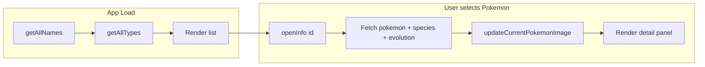
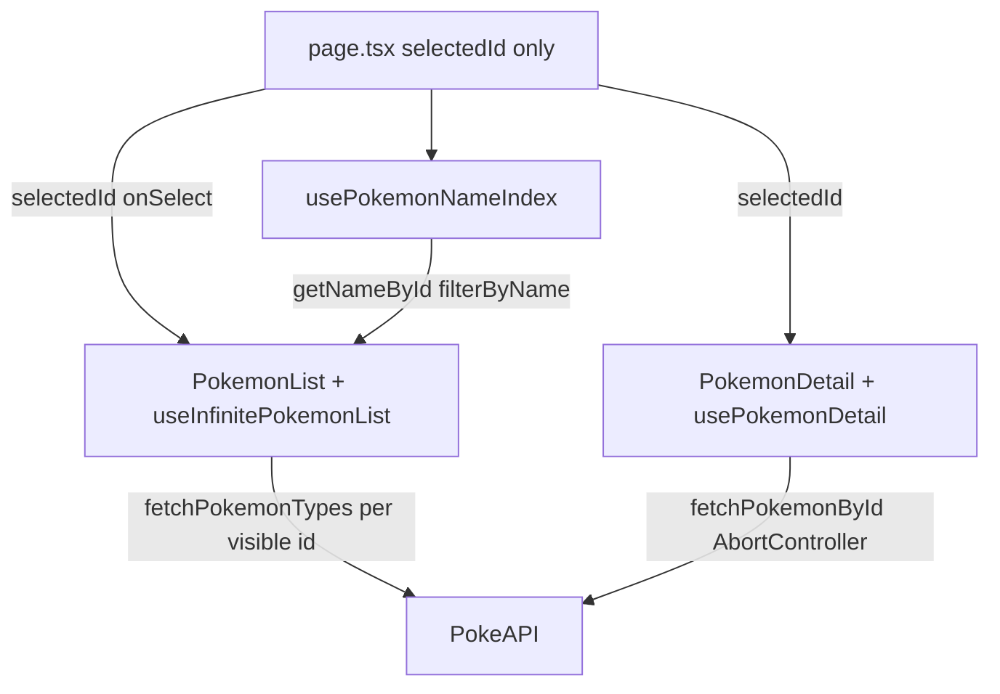
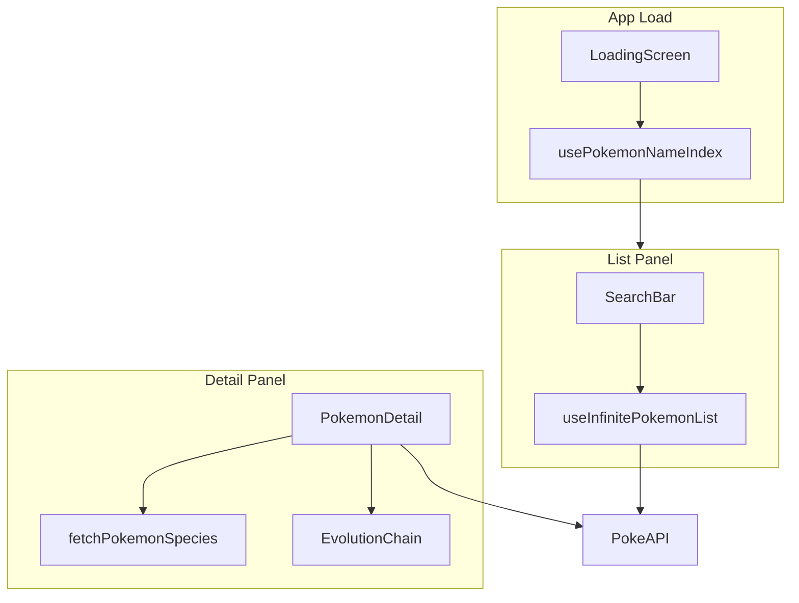

# Pokedex App — Project Plan

Build a Pokedex web app inspired by [pokedex.david-hckh.com](https://pokedex.david-hckh.com/) using **Next.js + TypeScript**.

## Current status

| Phase | Status | Verified |
|-------|--------|----------|
| **Phase 1** | Complete | [tests/reports/phase-1-report.md](../tests/reports/phase-1-report.md) (PASS) |
| **Phase 2** | Complete | [tests/reports/phase-2-report.md](../tests/reports/phase-2-report.md) (PASS) |
| **Phase 3** | Complete | [tests/reports/phase-3-report.md](../tests/reports/phase-3-report.md) (PASS) |
| **Phase 4** | Complete | [phase-4-report.md](../tests/reports/phase-4-report.md) (PASS — Part A/B/C/D/E) |
| **Phase 5** | Complete | Store-ready PWA + growth features |
| **Phase 6** | Complete | [phase-6-report.md](../tests/reports/phase-6-report.md) (Part M watermark & filters) |
| **Phase 7** | Complete (Option C) | [phase-7-report.md](../tests/reports/phase-7-report.md) — local data + deploy hardening |
| **Phase 7B** | Complete | Local sprites (`public/sprites/`), no CDN; `npm run fetch-sprites` |
| **Phase 8** | Deferred | RSC / SSG file-based routes — see Phase 8 section |

**Phase 6 goal:** Fix regressions from Phase 5 dark mode and toolbar expansion — empty-state sprite clipping, scrolling background, single-row search toolbar, dark-theme contrast, back-to-top visibility/position, share icon button, mobile modal sprite display, no sidebar Pokeball loader, unified `tests/` layout, and automated UI contrast/layout regression tests.

**Phase 1 delivered:** two-panel layout, paginated list (IDs 1–1025), detail panel with animated Gen V sprites, stats, abilities, error/retry, desktop + stacked mobile layout.

**Phase 2 delivered:** search, infinite scroll, Pokedex entry, evolution chain, panel animations, mobile modal, loading screen.

**Phase 3 delivered:** UI polish and reference parity — instant card names, smooth selection UX, fixed desktop detail panel, scrollable detail content, horizontal stats layout, Pokeball detail loader, back-to-top, production metadata and error handling.

**Phase 4 goal:** Reference visual parity per [pokedex.david-hckh.com](https://pokedex.david-hckh.com/). **Part A/B** delivered overlap fixes and sidebar density. **Part C** closed gaps from the 2026-06-14 reference audit in [PLAN_REVIEWED.md](./PLAN_REVIEWED.md). **Part D** addresses user-reported sidebar UX: wider panel, reduced top margin, separate stat pills, no inner empty border, animated loading Pokeball, evolution visible without horizontal scroll where possible.

**Phase 7 goal (complete — Option C + 7B):** Bundled local JSON under `public/data/` and local sprites under `public/sprites/`; security headers; SW data + sprite runtime cache; zero runtime PokeAPI or GitHub CDN.

**Phase 7B goal (complete):** 1025 PNG + 649 GIF sprites in `public/sprites/`; sprite helpers use local paths; `remotePatterns` removed; `fetch-sprites` script; e2e confirms no external sprite CDN.

**Phase 5 goal:** Make the app deployable and store-ready (PWA install, icons/splash, offline shell, favorites, type filters) via web + optional native wrapper.

---

## Reference site analysis

The reference is an open-source vanilla JS project ([davidhckh/pokedex](https://github.com/davidhckh/pokedex)) based on a [Dribbble redesign concept](https://dribbble.com/shots/15128634-Pokemon-Pokedex-Website-Redesign-Concept).

### What the reference site does



| Area | Behavior |
|------|----------|
| **Layout** | Left: searchable grid with infinite scroll. Right: fixed detail panel (~320px). |
| **Data** | PokeAPI — `/pokemon`, `/pokemon-species`, `/evolution-chain`, `/type` |
| **Character animation** | PokeAPI animated GIFs for Gen V Black/White sprites (IDs 1–649). Static PNG fallback for newer Pokemon. |
| **UI animation** | CSS slide-in/out on detail panel, rotating Pokeball loader, hover scale on list cards |
| **Detail content** | ID, name, type badges, Pokedex entry, height/weight, abilities, 6 stats + total, evolution chain |

### How Pokemon sprite animation works

The character animation is **not** hand-coded frame animation. When a Pokemon is selected, the site swaps the `` source to an animated GIF from PokeAPI's sprite repo:

```javascript
if (id >= 650) {
  img.src = `.../sprites/pokemon/${id}.png`;  // static fallback
} else {
  img.src = `.../sprites/pokemon/versions/generation-v/black-white/animated/${id}.gif`;
}
```

CSS `image-rendering: pixelated` preserves the retro pixel-art look. Height is scaled dynamically (`spriteHeight * 3`) so the sprite sits above the info card regardless of sprite dimensions.

---

## Folder structure

Organize by **feature domain** (list vs detail) and **layer** (UI, data, hooks). Keep Phase 1 flat where a subfolder would only hold one file.

```
pokedex/
├── .cursor/
│   └── skills/
│       ├── verify-pokedex-task/     # Phase verification (lint/build/unit + code review)
│       │   ├── SKILL.md
│       │   └── phase-checklists.md
│       └── check-pokedex-ui/        # Browser GUI checks (Playwright e2e + UI report)
│           ├── SKILL.md
│           ├── ui-checklist.md
│           └── report-template.md
├── tests/                           # Test cases and verification reports
│   ├── phase-1/
│   ├── phase-2/
│   ├── phase-3/
│   ├── phase-4/
│   ├── phase-5/
│   ├── phase-6/
│   └── reports/
├── docs/
│   └── PLAN.md                      # This file — source of truth for tasks
├── public/
│   └── assets/                      # Static UI assets (Phase 2: pokeball watermark, icons)
│       └── .gitkeep
├── src/
│   ├── app/                         # Next.js App Router — routes and global shell only
│   │   ├── layout.tsx               # Root layout, Outfit font, metadata + openGraph
│   │   ├── page.tsx                 # Two-column shell; lifts selectedId state only
│   │   ├── error.tsx                # Route-level error boundary UI
│   │   └── globals.css              # Global tokens, layout, reference-inspired theme
│   ├── components/
│   │   ├── detail/                  # Right panel — selected Pokemon view
│   │   │   ├── PokemonDetail.tsx    # Empty / loading / loaded / error states
│   │   │   ├── AnimatedSprite.tsx   # Gen V GIF + PNG fallback + height scaling
│   │   │   └── StatBar.tsx          # exports PokemonStats — horizontal stat pills
│   │   ├── list/                    # Left panel — browse grid
│   │   │   ├── PokemonList.tsx      # Paginated grid + "Load more"
│   │   │   └── PokemonCard.tsx      # Thumbnail (next/image), id, name, type badges
│   │   └── shared/                  # Reused across list and detail
│   │       ├── TypeBadge.tsx        # Colored type pill
│   │       ├── LoadingScreen.tsx    # Initial Pokeball loader
│   │       └── BackToTop.tsx        # Floating scroll-to-top button
│   ├── hooks/
│   │   ├── usePokemonList.ts        # Phase 1 legacy pagination hook
│   │   ├── useInfinitePokemonList.ts # Phase 2+ infinite scroll + types cache
│   │   ├── usePokemonNameIndex.ts   # Phase 2+ name index + search filter
│   │   └── usePokemonDetail.ts      # Detail fetch with AbortController
│   ├── lib/                         # No React — pure data and constants
│   │   ├── data.ts                  # Phase 7+ — fetch from /data/*.json
│   │   ├── pokeapi.ts               # Sprite URL helpers (CDN until Phase 7B)
│   │   ├── types.ts                 # PokemonListItem, PokemonDetail, API shapes
│   │   └── constants.ts             # TYPE_COLORS, STAT_COLORS, TOTAL_POKEMON
│   └── utils/
│       └── format.ts                # formatPokemonId, capitalizeName, formatHeight, formatWeight
├── .gitignore
├── eslint.config.mjs
├── next.config.ts                   # images.remotePatterns for raw.githubusercontent.com
├── package.json
├── tsconfig.json
└── README.md
```

### Structure rationale

| Path | Responsibility | Why separate |
|------|----------------|--------------|
| `src/app/` | Routing and page shell only | App Router convention; keeps `page.tsx` thin |
| `src/components/list/` vs `detail/` | Feature-specific UI | Matches the two-panel layout; avoids a flat `components/` dump |
| `src/components/shared/` | Cross-cutting UI | `TypeBadge` used in both list cards and detail header |
| `src/lib/` | Data client + types + constants | Testable without React; `data.ts` for JSON, `pokeapi.ts` for sprite URLs |
| `src/hooks/` | Client-side data fetching | Encapsulates list pagination and detail fetch logic |
| `src/utils/` | Pure string/number formatting | Keeps components free of display logic |
| `public/assets/` | Local images | PokeAPI sprites are remote; local assets are for UI chrome only |
| `docs/PLAN.md` | Task tracking | Agents and verify skill read the same checklist |

### Import alias

Use `@/*` → `src/*` (from `create-next-app`):

```typescript
import { fetchPokemonById } from "@/lib/pokeapi";
import { PokemonDetail } from "@/components/detail/PokemonDetail";
```

### Phase 2 additions (complete)

```
src/
├── components/
│   ├── detail/
│   │   └── EvolutionChain.tsx       # Clickable evolution sprites + levels
│   ├── list/
│   │   └── LoadMoreTrigger.tsx      # Optional sentinel for infinite scroll
│   ├── search/
│   │   └── SearchBar.tsx
│   └── shared/
│       └── LoadingScreen.tsx        # Initial Pokeball loader
├── hooks/
│   ├── useInfinitePokemonList.ts    # Replaces pagination in usePokemonList
│   └── usePokemonNameIndex.ts       # One-time /pokemon?limit=1025 cache
public/
└── assets/
    ├── pokeball-icon.png            # Loading + watermark
    └── close-icon.png               # Mobile modal close
.github/
└── workflows/
    └── ci.yml                       # Optional lint + build
```

---

## Architecture



### Tech choices

- **Next.js 16 App Router** + **TypeScript** (upgraded from 15 during scaffold; App Router APIs unchanged for this project)
- **Global CSS** (no Tailwind in Phase 1) — closest to reference custom styling
- **Client components** for list selection, detail panel, GIF `onLoad` height scaling
- **Data fetching: client-side only in Phase 1** — no RSC data fetch, no `loading.tsx` / `Suspense` for list or detail
- **Image strategy (split)**:
  - `next/image` in `PokemonCard.tsx` for static list thumbnails (lazy load, responsive sizing)
  - Plain `` in `AnimatedSprite.tsx` for animated GIFs (`next/image` is a poor fit for external animated GIFs and dynamic height scaling)
- **`next.config.ts`** — add `images.remotePatterns` for `raw.githubusercontent.com`
- **No API routes in Phase 1** — PokeAPI supports browser CORS

---

## Decisions (from plan review)

Resolved 2026-06-14 from [PLAN_REVIEWED.md](./PLAN_REVIEWED.md).

| Question | Decision |
|----------|----------|
| **Q1: Paginated load vs pre-load all names?** | Paginated display, numeric ID list **1–1025**, no full name preload in Phase 1. UI shows 30 IDs at a time; "Load more" extends by 30. Each visible card fetches `/pokemon/{id}` once (cached in `usePokemonList`). Phase 2 search adds one-time `/pokemon?limit=1025` name index. |
| **Q2: Selected card highlight?** | **Yes** in Phase 1 — distinct border on active card; pass `selectedId` into `PokemonList` → `PokemonCard`. |
| **Q3: Auto-select first Pokemon?** | **No** — keep empty detail panel on first load ("Select a Pokemon to display here."). |
| **Q4: Pokemon count cap?** | **IDs 1–1025** (matches reference `TOTAL_POKEMONS = 1025`). |
| **Q5: Alternate forms?** | **Exclude** — only base national dex entries via numeric IDs. Mega/gmax/regional forms out of scope. |
| **Q6: Build check manual or CI?** | **Manual** for Phase 1 (verify skill subagents run `npm run build`). GitHub Actions CI optional in Phase 2. |
| **Q7: Phase 1 viewport scope?** | **Desktop-first (≥1100px)** with minimal mobile fallback: stacked layout (list full width, detail below, scrollable). No modal/backdrop until Phase 2. |
| **Q8: Shared list/detail cache?** | **No shared detail cache** — list caches **types only** (`typesCache`); `usePokemonDetail` always fetches full `/pokemon/{id}` (+ species). Phase 3 `fix-fetch-cache` scope is list fetch reliability + no double-jump UX, not reusing list data in detail. |
| **Q9: Phase 3 unit tests required?** | **No new Phase 3 unit tests** — verify with existing `npm test` (Phase 1/2 suites) plus lint/build and manual browser scenarios. |
| **Q10: Desktop detail panel CSS?** | **CSS variables** — `@media (min-width: 1100px)`: `.pokemon-detail-panel { position: fixed; width: var(--detail-width); height: var(--detail-panel-height); bottom: var(--detail-panel-offset-bottom); }`; `.detail-card { flex: 1; overflow-y: auto; }`; list `width: calc(100% - var(--detail-width) - 40px)`. |
| **Q11: Hook contract accuracy?** | **Updated** — plan documents `useInfinitePokemonList` and `usePokemonNameIndex` as the Phase 2+ list hooks; `usePokemonList` retained as legacy Phase 1 only. |
| **Q12: `POKEAPI_BASE` in plan?** | **Added** to Constants section — matches `constants.ts`. |
| **Q13: Next.js 16 breaking changes?** | **None affecting this app** — client components, App Router layout/page/error patterns unchanged; plan version updated to 16. |
| **Q14: Phase 4 unit tests required?** | **No** — extend e2e + `check-pokedex-ui` skill; lint/build + existing Vitest green. |
| **Q15: App store strategy?** | **PWA first** (installable web app), then optional **Capacitor** wrapper for iOS/Android store submission; no separate native rewrite. |
| **Q16: Part A verify before Part B?** | **Combined** — single `phase-4-verify` after Part B; run `npm run test:e2e` before Part B to confirm Part A did not regress Phase 3. |
| **Q17: Detail loading CSS class names?** | **Part D** — sidebar loading uses animated `.detail-loading-ball` (60px, `rotatePokeBall`); legacy `.detail-panel-loading-ball` watermark superseded. |
| **Q18: `formatPokemonId` in plan?** | **Added** — `N° {id}` format used in list cards and detail panel. |
| **Q19: Phase 3 empty state text?** | **Superseded** — Phase 4 Part A `detail-empty-state` (Pikachu watermark + two-line prompt); Phase 1 task kept for history with cross-reference. |
| **Q20: Back-to-top position (desktop)?** | **Superseded by Q30** — safe zone at list/sidebar gap: `right: calc(var(--detail-width) + 60px); bottom: 24px` (not `left: 24px`, not viewport `right: 20px` under sidebar). |
| **Q21: Part B e2e timing?** | **Write with each fix** — overlap regression tests per task, not deferred to verify. |
| **Q22: `check-pokedex-ui` skill in plan?** | **Documented** in folder structure. |
| **Q23: Detail sprite anchoring?** | **`position: fixed`** within panel column — `bottom: calc(var(--detail-panel-offset-bottom) + var(--detail-panel-height) - 6vh)`; sprite **sibling** of scrollable `.detail-card`; `padding-top: 11vh` on card clears ID/name. |
| **Q24: Capacitor bundling?** | **Hosted web URL in WebView first** — Capacitor loads deployed PWA URL; static `output: 'export'` only if offline-native bundle required (needs `images.unoptimized: true`). |
| **Q25: Service worker library?** | **Evaluate at Phase 5 start** — confirm `@serwist/next` vs hand-rolled SW against Next.js 16.2.x docs before choosing. |
| **Q26: Deep link approach?** | **Hash routing** — `#pokemon/25` via client-only `window.location.hash` (no Suspense wrapper). |
| **Q27: Filter pipeline?** | **Composable `number[]` pipeline** — `ALL_IDS` → `filterByName` → `filterByType` → `filterByFavorites` → `useInfinitePokemonList(sourceIds)`. |
| **Q28: Panel flush with viewport?** | **`bottom: 0`** — `--detail-panel-offset-bottom: 0` to match reference `#current-pokemon-container { bottom: 0 }`. |
| **Q29: Detail panel width?** | **`320px`** — `--detail-width: 320px` matches reference; list offset `calc(100% - 360px)` (320 + 40 gap). |
| **Q30: Back-to-top safe zone?** | **`right: calc(var(--detail-width) + 60px); left: auto; bottom: 24px`** on desktop — between list and sidebar, no card overlap. |
| **Q31: Back-to-top icon?** | **Inline SVG arrow** — crisp cross-browser; optional `public/assets/arrow-up-icon.png` later. |
| **Q32: ID format `N°` vs `#`?** | **Keep `N° {id}`** — intentional premium typography; e2e asserts `N° 25`. Reference uses `#213`. |
| **Q33: Empty state placeholder?** | **Neutral asset** — add `public/assets/no-pokemon-selected.png` (reference silhouette) or grayscale Pokéball; replace recognizable Pikachu. |
| **Q34: Panel height?** | **`82vh`** — `--detail-panel-height: 82vh` matches reference. |
| **Q35: Detail sprite max-height?** | **`22vh`** — matches reference `#current-pokemon-image { max-height: 22vh }`. |
| **Q36: Card grid 4-col vs flex wrap?** | **Intentional** — CSS grid `repeat(4, 1fr)` on desktop; reference uses fluid flex — our grid is more predictable. |

---

## Constants

Embed in [`src/lib/constants.ts`](../src/lib/constants.ts) — sourced from [reference list.js](https://pokedex.david-hckh.com/javascript/list.js) and [style.css](https://pokedex.david-hckh.com/style.css):

```typescript
export const TYPE_COLORS: Record<string, string> = {
  normal: "#BCBCAC", fighting: "#BC5442", flying: "#669AFF",
  poison: "#AB549A", ground: "#DEBC54", rock: "#BCAC66",
  bug: "#ABBC1C", ghost: "#6666BC", steel: "#ABACBC",
  fire: "#FF421C", water: "#2F9AFF", grass: "#78CD54",
  electric: "#FFCD30", psychic: "#FF549A", ice: "#78DEFF",
  dragon: "#7866EF", dark: "#785442", fairy: "#FFACFF",
  shadow: "#0E2E4C",
};

export const STAT_COLORS: Record<string, string> = {
  hp: "#df2140", atk: "#ff994d", def: "#eecd3d",
  spa: "#85ddff", spd: "#96da83", speed: "#fb94a8", total: "#7195dc",
};

export const SPRITE_BASE =
  "https://raw.githubusercontent.com/PokeAPI/sprites/master/sprites/pokemon";

export const TOTAL_POKEMON = 1025;

export const POKEAPI_BASE = "https://pokeapi.co/api/v2";
```

---

## Hook contracts

### `usePokemonList` *(Phase 1 legacy — superseded by `useInfinitePokemonList`)*

```typescript
// src/hooks/usePokemonList.ts
function usePokemonList(pageSize = 30): {
  visibleIds: number[];
  loadMore: () => void;
  cache: Map<number, PokemonListItem>;
  loadingIds: Set<number>;
};
```

- Retained for reference; production list uses `useInfinitePokemonList` (Phase 2+)

### `useInfinitePokemonList` *(Phase 2+ production list hook)*

```typescript
// src/hooks/useInfinitePokemonList.ts
function useInfinitePokemonList(sourceIds: number[], pageSize = 30): {
  visibleIds: number[];
  typesCache: Map<number, string[]>;   // types only — not full PokemonListItem
  loadingIds: Set<number>;
  sentinelRef: RefObject<HTMLDivElement | null>;
  hasMore: boolean;
};
```

- Takes filtered `sourceIds` from search (`usePokemonNameIndex.filterByName`)
- Fetches types via `fetchPokemonTypes` with concurrency limit (6); marks `fetchedRef` only on success
- `loadMore` is internal — triggered by `IntersectionObserver` on `sentinelRef`

### `usePokemonNameIndex` *(Phase 2+)*

```typescript
// src/hooks/usePokemonNameIndex.ts
function usePokemonNameIndex(): {
  index: PokemonNameEntry[];
  loading: boolean;
  error: string | null;
  filterByName: (query: string) => number[];
  nameById: Map<number, string>;
  getNameById: (id: number) => string | undefined;
};
```

- One-time `GET /pokemon?limit=1025`; powers search and instant card names (Phase 3)

### `usePokemonDetail`

```typescript
// src/hooks/usePokemonDetail.ts
function usePokemonDetail(id: number | null): {
  data: PokemonDetail | null;
  loading: boolean;
  error: string | null;
  retry: () => void;
};
```

- Uses `AbortController` to cancel in-flight requests when `id` changes
- Ignores stale responses from previous selections

---

## Phase 1 tasks (complete)

Verified 2026-06-14 — see [phase-1-report.md](../tests/reports/phase-1-report.md).

| ID | Task | Status |
|----|------|--------|
| `scaffold-nextjs` | Initialize Next.js + TypeScript with App Router, ESLint, `src/`, global CSS | [x] |
| `data-layer` | Create `lib/pokeapi.ts`, `types.ts`, `constants.ts` with fetch helpers and sprite URL logic | [x] |
| `sprite-component` | Build `AnimatedSprite` with Gen V GIF + PNG fallback and dynamic height scaling | [x] |
| `list-panel` | Build `PokemonList` + `PokemonCard` with paginated grid and type badges | [x] |
| `detail-panel` | Build `PokemonDetail` with stats, abilities, height/weight, empty/loading/error states | [x] |
| `wire-page` | Connect selection state in `page.tsx` and apply reference-inspired CSS styling | [x] |

### Task details

#### 1. `scaffold-nextjs`

```bash
npx create-next-app@latest . --typescript --eslint --app --no-tailwind --src-dir --import-alias "@/*" --yes --disable-git
```

Create folder skeleton under `src/components/{detail,list,shared}`, `src/hooks`, `src/lib`, `src/utils`, `public/assets`.

Configure `next.config.ts` with remote image patterns:

```typescript
images: {
  remotePatterns: [
    {
      protocol: "https",
      hostname: "raw.githubusercontent.com",
      pathname: "/PokeAPI/sprites/**",
    },
  ],
},
```

#### 2. `data-layer`

| Function | Endpoint | Purpose |
|----------|----------|---------|
| `fetchPokemonById(id)` | `GET /pokemon/{id}` | Stats, types, abilities, height, weight, `species.url` |
| `getAnimatedSpriteUrl(id)` | — | Gen V GIF URL or PNG fallback |
| `getStaticSpriteUrl(id)` | — | `${SPRITE_BASE}/${id}.png` for list thumbnails |

```typescript
interface PokemonListItem {
  id: number;
  name: string;
  types: string[];
}

interface PokemonDetail {
  id: number;
  name: string;
  types: string[];
  height: number;   // decimeters → display as meters (/10)
  weight: number;   // hectograms → display as kg (/10)
  abilities: string[];
  stats: { name: string; value: number }[];
  // Phase 2 — optional to avoid breaking changes
  speciesUrl?: string;
  flavorText?: string;
  evolutionChainUrl?: string;
}
```

- Store `speciesUrl` from `pokemon.species.url` in `fetchPokemonById` response mapping
- Stats mapped by `stat.name`, not array index
- Display helpers in `utils/format.ts`: `formatPokemonId` (`N° {id}`), `capitalizeName`, `formatHeight`, `formatWeight`

#### 3. `sprite-component`

```typescript
function getAnimatedSpriteUrl(id: number): string {
  return id < 650
    ? `${SPRITE_BASE}/versions/generation-v/black-white/animated/${id}.gif`
    : `${SPRITE_BASE}/${id}.png`;
}
```

- On `img.onload`: set container height to `naturalHeight * 3`; if `naturalWidth === 0`, fall back to static PNG
- On `onError`: fall back to static PNG (`getStaticSpriteUrl`)
- Use plain `` with `image-rendering: pixelated`
- Reliable GIF range: IDs **1–649** (some within range may still lack GIFs)

#### 4. `list-panel`

- `usePokemonList` hook manages `visibleIds` (1–1025), pagination, and per-id fetch cache
- White rounded cards in a flex-wrap grid
- Static sprite via `next/image` above card (`position: absolute; top: -55px`)
- Pokemon `#id`, capitalized name, type badges
- Click → `onSelect(id)` to parent
- **Selected card highlight** — distinct border when `id === selectedId`
- First 30 Pokemon + "Load more" button (extends visible range by 30)
- List cards are keyboard-accessible (`<button>` or `role="button"` + `tabIndex={0}`)

#### 5. `detail-panel`

Four states:

| State | UI |
|-------|-----|
| **Empty** | "Select a Pokemon to display here." (when `selectedId` is null) — *superseded by Phase 4 Part A `detail-empty-state`* |
| **Loading** | Spinner or skeleton while fetching — *Phase 3 pokeball loader; Phase 4 uses faint watermark (see `detail-loading-state`)* |
| **Loaded** | `AnimatedSprite`, ID (`N° {id}`), name, types, height, weight, abilities, stats row |
| **Error** | "Couldn't load Pokémon data. Try again." + retry button |

- `usePokemonDetail` hook lives inside or is consumed by `PokemonDetail`
- Skip Pokedex flavor text and evolution chain in Phase 1
- Sprite `alt` text: e.g. `"Pikachu sprite"`

#### 6. `wire-page`

Only `selectedId` is lifted to `page.tsx`:

```typescript
const [selectedId, setSelectedId] = useState<number | null>(null);
```

- `PokemonList` receives `selectedId` + `onSelect`
- `PokemonDetail` receives `selectedId`; fetches its own data via `usePokemonDetail`
- **Desktop (≥1100px)**: two-panel layout — list left, fixed detail sidebar (~320px) right
- **Mobile (<1100px)**: stacked layout — list full width, detail panel below (scrollable)

Styling tokens from [reference style.css](https://pokedex.david-hckh.com/style.css):

- Background: `#f6f8fc`
- Cards: white, `border-radius: 20px`, soft shadow
- Font: [Outfit](https://fonts.google.com/specimen/Outfit) via `next/font/google`
- Type badge colors: `TYPE_COLORS` constant (see Constants section)
- Stat label colors: `STAT_COLORS` constant (see Constants section)

---

## Phase 2 tasks

Mark each task `[x]` when done. After **all** Phase 2 tasks are complete, run phase verification (see `.cursor/skills/verify-pokedex-task/`).

| ID | Task | Status |
|----|------|--------|
| `loading-screen` | Initial loading overlay with rotating Pokeball; hide after name index ready | [x] |
| `search` | `usePokemonNameIndex` + `SearchBar`; client-side filter over cached names | [x] |
| `infinite-scroll` | `useInfinitePokemonList` + sentinel; replace "Load more" button | [x] |
| `species-detail` | `fetchPokemonSpecies`; populate `flavorText` and `evolutionChainUrl` in detail | [x] |
| `evolution-chain` | `EvolutionChain.tsx` — sprites, levels, click to switch Pokemon | [x] |
| `panel-animation` | CSS `slideIn` / `slideOut` on detail panel when Pokemon changes (desktop) | [x] |
| `mobile-modal` | Full-screen detail modal + type-colored backdrop + close button at `< 1100px` | [x] |
| `github-ci` | *(optional)* GitHub Actions workflow for lint + build on push | [x] |

### Task details

#### 1. `loading-screen`

- Add `public/assets/pokeball-icon.png` (from reference or similar asset)
- `LoadingScreen.tsx` — full-viewport overlay, rotating Pokeball (`@keyframes rotatePokeBall`)
- Show on app mount while `usePokemonNameIndex` (or list bootstrap) loads
- Slide-up dismiss animation matching reference (`hideLoading` keyframes)
- Set `document.body.style.overflow = hidden` during load; restore after

#### 2. `search`

- `fetchPokemonNameIndex()` — one-time `GET /pokemon?limit=1025`; cache `{ id, name }[]`
- `usePokemonNameIndex` hook — loading state, cached index, `filterByName(query)`
- `SearchBar.tsx` — input + search icon; debounced filter (reference uses keydown + 1ms timeout)
- `PokemonList` filters `visibleIds` or indexed list by query; empty state when no matches
- Reset scroll position on new search

#### 3. `infinite-scroll`

- `useInfinitePokemonList` — drop-in upgrade from `usePokemonList`
- `IntersectionObserver` on sentinel element at grid bottom (or scroll listener like reference)
- Load next 30 IDs when sentinel visible; remove "Load more" button
- List caches **types only** (`typesCache`); names come from `usePokemonNameIndex` (Phase 3)

#### 4. `species-detail`

Extend [`src/lib/pokeapi.ts`](../src/lib/pokeapi.ts):

| Function | Endpoint | Purpose |
|----------|----------|---------|
| `fetchPokemonSpecies(url)` | `GET /pokemon-species/{id}` | English flavor text, evolution chain URL |
| `fetchEvolutionChain(url)` | `GET evolution-chain` | Chain tree for evolution UI |

- In `usePokemonDetail`: after `fetchPokemonById`, fetch species using `speciesUrl`
- Set `flavorText` — first English `flavor_text_entries` entry; strip `\f`, normalize whitespace
- Set `evolutionChainUrl` from `species.evolution_chain.url`
- Display flavor text in `PokemonDetail` under "Pokedex Entry" heading

#### 5. `evolution-chain`

- `EvolutionChain.tsx` — up to 3 sprites + level labels between stages
- Parse reference-style chain: base → stage 1 → stage 2
- Static PNG sprites for evolution thumbnails; click calls `onSelect(id)`
- Hide section when no evolutions (`evolves_to.length === 0`)
- Level label: `Lv. {min_level}` or `"?"` when no level requirement

#### 6. `panel-animation`

Port from [reference style.css](https://pokedex.david-hckh.com/style.css):

```css
.slide-out { animation: slideOut 0.35s ease-in-out forwards; }
.slide-in  { animation: slideIn 0.35s ease-in-out forwards; }
```

- On Pokemon change (desktop ≥1100px): `slideOut` → fetch → `slideIn`
- Skip or simplify on mobile modal path

#### 7. `mobile-modal`

At `max-width: 1099px`:

- Detail panel becomes fixed full-screen modal (`z-index: 2`)
- Type-colored backdrop overlay (`current-pokemon-responsive-background`) — opacity transition
- Close button (`public/assets/close-icon.png`) — calls `closePokemonInfo()`, restores scroll
- `html { overflow: hidden }` while modal open
- Reference breakpoint: **1100px**

#### 8. `github-ci` *(optional)*

- `.github/workflows/ci.yml` — `npm ci`, `npm run lint`, `npm run build` on push/PR
- No deploy step in Phase 2

### Phase 2 architecture



### Phase 2 implementation order

1. `loading-screen` + `usePokemonNameIndex` bootstrap
2. `search` — SearchBar wired to name index
3. `infinite-scroll` — replace Load more with observer
4. `species-detail` — flavor text in detail panel
5. `evolution-chain` — EvolutionChain component
6. `panel-animation` — desktop slide transitions
7. `mobile-modal` — replace stacked layout with modal + backdrop
8. `github-ci` — optional CI workflow
9. Run phase-2 verification skill; manual test search, scroll, evolution, modal

---

## PokeAPI notes

1. **Rate limits** — fair-use; cache in memory or add SWR/React Query in Phase 2.
2. **Type mapping** — Phase 1 reads types from each `/pokemon/{id}` response; skip the reference's slow 18-type prefetch.
3. **Animated sprite gaps** — some IDs 404 or return broken GIFs; use `onError` **and** `naturalWidth === 0` check in `onLoad` to fall back to PNG.
4. **Stat order** — map by `stat.name`, not array index (reference has an HP/ATK index bug).
5. **List scope** — IDs 1–1025 only; alternate forms (mega, gmax) excluded.

---

## Phase 1 success criteria (complete)

- [x] App loads a grid of Pokemon (IDs 1–1025, 30 at a time with "Load more")
- [x] Clicking a Pokemon shows its detail in a fixed right panel (desktop) or below list (mobile)
- [x] Selected Pokemon displays an animated GIF sprite (Gen V) that loops automatically
- [x] Detail shows: ID, name, types, height, weight, abilities, and all 6 stats + total
- [x] Layout visually resembles the reference site's two-panel desktop design
- [x] Selected list card is visually highlighted
- [x] Error state with retry when detail fetch fails
- [x] Keyboard-accessible list cards (`button` or `role="button"`)
- [x] Descriptive `alt` text on sprite images
- [x] Basic stacked layout works below 1100px
- [x] `npm run build` passes with no TypeScript errors (manual check; CI optional Phase 2)

---

## Phase 2 success criteria

- [x] Initial loading screen with rotating Pokeball dismisses after data ready
- [x] Search filters Pokemon by name across all 1025 entries
- [x] Scrolling list bottom loads more Pokemon automatically (no "Load more" button)
- [x] Pokedex entry (English flavor text) shown in detail panel
- [x] Evolution chain shows sprites, levels, and clickable stages
- [x] Detail panel slides in/out on Pokemon change (desktop)
- [x] Below 1100px: full-screen modal, type-colored backdrop, close button
- [x] `npm run lint` and `npm run build` pass
- [x] Phase verification report PASS at `tests/reports/phase-2-report.md`

---

## Phase 3 tasks

Mark each task `[x]` when done. After **all** Phase 3 tasks are complete, run phase verification (see `.cursor/skills/verify-pokedex-task/`).

| ID | Task | Status |
|----|------|--------|
| `fix-card-names` | Show Pokemon names immediately on list cards from name index (no `#id` placeholder) | [x] |
| `fix-fetch-cache` | Fix per-id fetch/cache so detail panel does not double-jump on selection | [x] |
| `fixed-detail-panel` | Desktop detail panel stays fixed/sticky while list scrolls | [x] |
| `smooth-select-ux` | Smooth card selection and panel transitions without layout flicker | [x] |
| `detail-scroll-layout` | Detail panel content scrolls independently when it overflows (desktop) | [x] |
| `stats-reference-ui` | Stats section uses reference-style horizontal layout (not vertical stack) | [x] |
| `detail-loading-pokeball` | Detail loading state uses rotating Pokeball instead of generic spinner | [x] |
| `back-to-top` | Floating back-to-top button appears after scrolling one viewport | [x] |
| `production-polish` | Metadata, openGraph, route error boundary, final CSS polish | [x] |
| `phase-3-verify` | Run phase-3 verification skill; browser scenarios + automated checks | [x] |

### Task details

#### 1. `fix-card-names`

- Pass cached name from `usePokemonNameIndex` into `PokemonCard` so names render on first paint
- Cards show capitalized name + static sprite immediately; types still load from per-id fetch
- Remove `#id` placeholder and "..." loading name state when name index is ready

#### 2. `fix-fetch-cache`

- Fix list type fetch cache: only mark IDs in `fetchedRef` after successful fetch (aborted requests retry)
- Concurrency-limited `fetchPokemonTypes` for visible cards
- **No shared detail cache** — `usePokemonDetail` always fetches full payload; list stores types only
- Prevent sidebar height/content shift ("double-jump") via `displayId` guard and stable panel layout

#### 3. `fixed-detail-panel`

- Desktop (≥1100px) in `globals.css` (see Part C tokens):
  ```css
  .pokemon-detail-panel {
    position: fixed;
    right: calc(10vw - 20px);
    bottom: var(--detail-panel-offset-bottom);
    width: var(--detail-width);
    height: var(--detail-panel-height);
  }
  .pokemon-list { width: calc(100% - var(--detail-width) - 40px); }
  ```
- List panel scrolls independently; detail panel stays visible while browsing the grid
- Preserve mobile modal behavior from Phase 2 unchanged

#### 4. `smooth-select-ux`

- Selected card highlight transitions smoothly (border/color, no flash)
- Desktop panel slide animation only runs when Pokemon data actually changes, not on every click
- Keep previous detail content visible during slide-out until new data is ready (no empty flash)

#### 5. `detail-scroll-layout`

- Desktop in `globals.css`:
  ```css
  .detail-card {
    flex: 1;
    min-height: 0;
    overflow-y: auto;
  }
  .detail-sprite-wrapper { position: absolute; bottom: calc(100% - 6vh); }
  ```
- Long content (flavor text, evolution chain, stats) scrolls inside the panel, not the whole page
- Sprite stays anchored above the scrollable info card per reference layout

#### 6. `stats-reference-ui`

- `PokemonStats` component in `StatBar.tsx` — horizontal pill layout via `.stats-pills-row` / `.stat-pill-*`
- Six stat labels + values in a compact wrapped row; TOT row aligned with reference
- Use existing `STAT_COLORS` for label colors

#### 7. `detail-loading-pokeball`

- Reuse Pokeball asset and `@keyframes rotatePokeBall` from `LoadingScreen`
- Phase 3: small rotating loader — CSS class `.detail-loading-ball`
- Phase 4 Part A superseded sidebar loading with faint watermark — `.detail-panel-loading-ball` inside `.detail-card-loading` (see `detail-loading-state`)
- Keep empty and error states unchanged

#### 8. `back-to-top`

- `BackToTop.tsx` — client component, listens to `window.scrollY`
- Visible when `scrollY > window.innerHeight`; fixed bottom-right with card shadow
- Click scrolls smoothly to top; add to `page.tsx`

#### 9. `production-polish`

- `layout.tsx`: title "Pokedex", description, basic `openGraph` (title, description, type)
- `error.tsx`: friendly error UI with retry button (Next.js App Router error boundary)
- Final pass on globals.css tokens and transitions

#### 10. `phase-3-verify`

- All Phase 3 success criteria checked
- Browser scenarios in `tests/phase-3/browser-scenarios.md` pass
- `npm run lint` and `npm run build` pass; existing `npm test` suite (Phase 1/2) still green
- No new Phase 3 unit tests required (see Q9)
- Report saved to `tests/reports/phase-3-report.md`

### Phase 3 implementation order

1. `fix-card-names` — wire name index into list cards
2. `fix-fetch-cache` — list type cache reliability + double-jump fix
3. `fixed-detail-panel` — fixed desktop sidebar (`position: fixed`)
4. `smooth-select-ux` — selection + slide animation polish
5. `detail-scroll-layout` — scrollable detail content area
6. `stats-reference-ui` — horizontal stats grid
7. `detail-loading-pokeball` — Pokeball loader in detail
8. `back-to-top` + `production-polish` — BackToTop, metadata, error boundary
9. `phase-3-verify` — run verify skill and manual browser pass

---

## Phase 3 success criteria

- [x] List cards show Pokemon names immediately (from name index) without waiting for `/pokemon/{id}` fetch
- [x] Selecting a Pokemon does not cause the detail sidebar to double-jump or flash empty
- [x] Desktop detail panel stays fixed while the list scrolls (`position: fixed` at ≥1100px)
- [x] Card selection and panel transitions feel smooth (no layout flicker)
- [x] Detail panel content scrolls independently when content exceeds viewport height
- [x] Stats section matches reference horizontal layout (`PokemonStats` + `.stats-pills-row`)
- [x] Detail loading state shows rotating Pokeball
- [x] Back-to-top button appears after scrolling one viewport and returns to top on click
- [x] App metadata and openGraph tags set in root layout
- [x] Route-level error boundary renders friendly message with retry
- [x] `npm run lint` and `npm run build` pass
- [x] Phase verification report PASS at `tests/reports/phase-3-report.md`

---

## Phase 4 tasks (reference UI polish + layout refinement)

Post–Phase 3 work to match [pokedex.david-hckh.com](https://pokedex.david-hckh.com/). Audited in [PLAN_REVIEWED.md](./PLAN_REVIEWED.md) (reference HTML/CSS vs `globals.css`).

### Phase 4 verification status

| Sub-phase | Status | Report |
|-----------|--------|--------|
| Part A — initial polish | Complete | Code + partial e2e |
| Part B — overlap & density | Complete | [phase-4-report.md](../tests/reports/phase-4-report.md) PASS, [ui-check-phase-4-2026-06-14.md](../tests/reports/ui-check-phase-4-2026-06-14.md) PASS |
| Part C — reference parity | Complete | [phase-4-report.md](../tests/reports/phase-4-report.md) Part C PASS, [ui-check-phase-4c-2026-06-14.md](../tests/reports/ui-check-phase-4c-2026-06-14.md) PASS |
| Part D — sidebar density & UX | Complete | User feedback 2026-06-14 — wider panel, separate stats, no scroll, loading animation |
| Part E — sprite, typography, responsive | Complete | User feedback — sprite/id overlap, font size, stat rect borders, viewport scaling |

**Part B delivered (2026-06-14):** search/grid clearance, back-to-top non-overlap (interim `left: 24px`), sprite outside scroll, compact layout, evolution scroll tests. **Part C** fixes reference audit gaps (R1–R6, R8–R10 in PLAN_REVIEWED). **Part D** supersedes Part C width (380px → **440px**), merged stats row, static loading watermark, and empty-state inner card border.

### Desktop layout tokens (target after Part D)

```css
:root {
  --detail-width: 440px;              /* Part D: fit 3-stage evolution without clip */
  --detail-panel-height: 88vh;        /* Part D: more vertical room, less inner scroll */
  --detail-panel-offset-bottom: 0px;  /* flush with viewport bottom */
  --detail-card-margin-top: 2vh;      /* Part D: reduced top gap (was 6vh) */
  --detail-card-padding-top: 8vh;     /* Part D: reserved sprite zone (was 11vh) */
}
```

Sprite (reference `#current-pokemon-image`): `max-height: 20vh` (Part D may reduce from 22vh to save vertical space), `image-rendering: pixelated`, fixed within panel column — not inside `.detail-card` scroll.

### Part A — Initial reference polish (complete)

| ID | Task | Status |
|----|------|--------|
| `detail-sprite-scale` | Detail animated sprite uses reference scale (`naturalHeight × 3`, `max-height: 22vh`) | [x] |
| `detail-empty-state` | Empty sidebar: white card, gray Pikachu watermark above, two-line prompt | [x] |
| `detail-loading-state` | Loading sidebar: white card with large faint Pokeball watermark | [x] |
| `search-flow` | Search bar in document flow (scrolls away); back-to-top shortcut after one viewport | [x] |
| `sidebar-layout-fix` | Fixed panel positioning, list width beside sidebar, grid spacing | [x] |

### Part B — Layout fixes & sidebar UX (complete)

| ID | Task | Status |
|----|------|--------|
| `fix-search-grid-overlap` | First-row card sprites must not overlap the search bar (`padding-top: 68px` on grid) | [x] |
| `fix-back-to-top-overlap` | Back-to-top must not cover list cards (interim: `left: 24px` — **revised in Part C**) | [x] |
| `center-detail-sprite` | Sprite fixed above scrollable card; `padding-top: 11vh` on `.detail-card` | [x] |
| `redesign-empty-sidebar` | Larger empty card, Pikachu watermark, subtitle, ghost placeholders | [x] |
| `compact-detail-layout` | Height+Weight 2-col; Abilities 2×2; Evolution horizontal scroll | [x] |
| `phase-4-verify` | Lint/build/test/e2e + `tests/phase-4/browser-scenarios.md` + reports | [x] |

### Part C — Reference parity fixes (complete)

From [PLAN_REVIEWED.md](./PLAN_REVIEWED.md) Section 2–3. Run `phase-4c-verify` when all tasks `[x]`.

| ID | Task | Status |
|----|------|--------|
| `fix-detail-panel-flush` | `--detail-panel-offset-bottom: 0` — panel flush with viewport bottom (Q28) | [x] |
| `fix-panel-dimensions` | `--detail-width: 320px`, `--detail-panel-height: 82vh`, sprite `max-height: 22vh` (Q29, Q34, Q35) | [x] |
| `fix-back-to-top-position` | Desktop: `right: calc(var(--detail-width) + 60px)` — list/sidebar safe zone (Q30, supersedes Q20) | [x] |
| `fix-back-to-top-icon` | Replace Unicode `↑` with inline SVG arrow (Q31) | [x] |
| `fix-tot-stat-highlight` | TOT outer wrap `background: #88aaea`; inner circle `#7195dc` per reference HTML | [x] |
| `fix-empty-placeholder` | Neutral silhouette asset instead of Pikachu #25 (Q33) | [x] |
| `phase-4c-verify` | Re-run e2e + UI check; update `phase-4-report.md`; flush-bottom e2e assertion | [x] |

### Part D — Sidebar density & UX refinement (complete)

User feedback after Part C polish (screenshots 2026-06-14). Supersedes Part C merged-stats row and 380px width.

| ID | Task | Status |
|----|------|--------|
| `widen-detail-panel` | `--detail-width: 440px` — 3-stage evolution (e.g. Charmander line) visible without horizontal clip | [x] |
| `reduce-panel-top-margin` | `--detail-card-margin-top: 2vh`, `--detail-card-padding-top: 8vh`; recalc fixed sprite `top` | [x] |
| `increase-panel-height` | `--detail-panel-height: 88vh` — reduce need for `.detail-card` scrollbar | [x] |
| `separate-stat-pills` | Each stat (HP–SPD) in its own `#f6f8fc` pill; TOT in separate rounded-rect wrap — **not** one merged `.stats-pills-row` | [x] |
| `compact-detail-sections` | Tighter `.detail-section-title` margins, flavor text, evolution padding so typical Pokémon fits without scroll | [x] |
| `loading-pokeball-animation` | On select: rotating Pokeball (`.detail-loading-ball` + `rotatePokeBall`) instead of static faint watermark | [x] |
| `empty-state-flat` | No inner card border/shadow/gradient on empty sidebar — flat white panel + silhouette + prompt only | [x] |
| `phase-4d-verify` | Update e2e + `tests/phase-4/browser-scenarios.md`; lint/build/test/e2e PASS | [x] |

#### Open questions — Part D

| ID | Question | Decision |
|----|----------|----------|
| **Q37** | Sidebar width for full evolution? | **440px** — balances list width vs 3-sprite chain at 56–64px |
| **Q38** | Stats layout? | **Separate pills** per stat in one row; TOT in own rounded rect (user override of Part C merged row) |
| **Q39** | Avoid detail scrollbar? | Reduce top margin + `88vh` panel + compact section gaps; scroll only for long flavor + 3 abilities edge cases |
| **Q40** | Loading state? | **Animated rotating Pokeball** (`detail-loading-ball`) on Pokémon select until fetch completes |
| **Q41** | Empty state inner border? | **Remove** — `.detail-empty-card` no box-shadow, no gradient, transparent/minimal styling |

### Task details — Part D

#### 1. `widen-detail-panel`

- `--detail-width: 440px` in `:root`
- Update `.pokemon-list` width calc, sprite `left`/`max-width`, e2e sidebar position thresholds if needed
- `.evolution-chain`: `justify-content: center`, `overflow-x: visible` when chain fits; keep scroll fallback for 4+ stages

#### 2. `reduce-panel-top-margin`

- Add CSS variables `--detail-card-margin-top: 2vh`, `--detail-card-padding-top: 8vh`
- Apply to `.detail-card`, `.detail-empty-card`, desktop overrides
- Sprite fixed `top`: panel top + `var(--detail-card-margin-top)` (replace hardcoded `6vh`)

#### 3. `separate-stat-pills`

- `StatBar.tsx`: wrap each `StatPill` in `.stat-pill-item` with individual `#f6f8fc` background
- Remove single gray wrapper on `.stats-pills-row` (flex row, no shared background)
- TOT remains in `.stat-pill-tot-wrap` with `#88aaea` rounded rectangle

#### 4. `loading-pokeball-animation`

- `PokemonDetail.tsx` loading branch: use `className="detail-loading-ball"` on pokeball image (60px, `rotatePokeBall` animation)
- Remove or demote static `.detail-panel-loading-ball` watermark for selected-state loading

#### 5. `empty-state-flat`

- Desktop `.detail-empty-card`: remove `box-shadow`, gradient background, extra padding creating “inner border”
- Keep outer panel structure; message + silhouette only

#### 6. `phase-4d-verify`

- E2e: evolution visible for Charmander (#4); stats count 7 with separate pill items; loading shows animated ball
- `npm run lint`, `npm run build`, `npm test`, `npm run test:e2e`

### Task details — Part C

#### 1. `fix-detail-panel-flush`

- Set `--detail-panel-offset-bottom: 0px` in `:root`
- Panel bottom edge within 2px of viewport bottom (e2e: `sidebar.y + sidebar.height >= viewport.height - 2`)
- Keep `border-bottom-left-radius: 0; border-bottom-right-radius: 0` on panel
- Slide animations already use `var(--detail-panel-offset-bottom)`

#### 2. `fix-panel-dimensions`

- `--detail-width: 320px` — match reference `#current-pokemon-container`
- `.pokemon-list { width: calc(100% - var(--detail-width) - 40px) }`
- `--detail-panel-height: 82vh`
- `.pokemon-detail-panel .animated-sprite { max-height: 22vh }`
- Recalculate fixed sprite `left`/`bottom` using `var(--detail-width)`

#### 3. `fix-back-to-top-position`

**Supersedes Part B `left: 24px` interim fix.**

```css
@media (min-width: 1100px) {
  .back-to-top {
    right: calc(var(--detail-width) + 60px);
    left: auto;
    bottom: 24px;
  }
}
```

- E2e: bounding box must not intersect any `.pokemon-card`
- Mobile: keep `right: 20px; bottom: 20px` per reference

#### 4. `fix-back-to-top-icon`

- Add inline SVG chevron/arrow in `BackToTop.tsx` (16px, dark stroke)
- Optional: `public/assets/arrow-up-icon.png` from [reference repo](https://github.com/davidhckh/pokedex)

#### 5. `fix-tot-stat-highlight`

Reference TOT markup uses dual-tone container:

```html
<div style="background: #88aaea">
  <div style="background: #7195dc">TOT</div>
  <h5>435</h5>
</div>
```

- Wrap TOT `StatPill` in `.stat-pill-tot-wrap { background: #88aaea; border-radius: 30px; padding: 3px; }`
- Six stat pills unchanged — **only circle labels colored**, never full-column fill on highest stat (Q32 adjacent rule)

#### 6. `fix-empty-placeholder`

- Add `public/assets/no-pokemon-selected.png` (reference silhouette) or neutral Pokéball
- Replace `getStaticSpriteUrl(25)` in empty state
- Keep two-line prompt + subtitle from Part B

#### 7. `phase-4c-verify`

- Update `tests/phase-4/browser-scenarios.md` (flush panel, back-to-top right zone, TOT highlight)
- Extend e2e: panel flush bottom, back-to-top position, TOT wrap present
- `npm run lint`, `npm run build`, `npm test`, `npm run test:e2e`
- Append Part C results to `tests/reports/phase-4-report.md` or save `phase-4c-report.md`
- Run `check-pokedex-ui` skill

### Task details — Part B (archive)

<details>
<summary>Part B implementation notes (complete)</summary>

#### `fix-search-grid-overlap`
- `.pokemon-grid { padding-top: 68px }` — 52px sprite overflow + 16px gap
- E2e: first-row sprite bottom ≥ search bar bottom at `scrollY === 0`

#### `fix-back-to-top-overlap` (interim — superseded by Part C)
- Was `left: 24px; bottom: 24px` — no card overlap but wrong side vs reference

#### `center-detail-sprite`
- Sprite sibling of `.detail-card`; `position: fixed` in panel column
- `.detail-card { padding-top: 11vh; padding-bottom: 32px }`
- E2e: sprite visible when card scrolls; no overlap with `.detail-id`

#### `compact-detail-layout`
- `.detail-info` 2-col grid; `.detail-abilities-pills` 2×2; `.evolution-chain` horizontal scroll
- Evolution sprites 64px (Part C may restore 74px at 320px width — verify fit)

</details>

### Phase 4 implementation order

**Part B (done):** search overlap → back-to-top → sprite → empty → compact → verify

**Part C:**
1. `fix-detail-panel-flush` + `fix-panel-dimensions` — layout tokens first
2. `fix-back-to-top-position` + `fix-back-to-top-icon`
3. `fix-tot-stat-highlight`
4. `fix-empty-placeholder`
5. `phase-4c-verify`

**Part D:**
1. `widen-detail-panel` + `increase-panel-height` — tokens first
2. `reduce-panel-top-margin` — sprite position recalc
3. `separate-stat-pills` + `compact-detail-sections`
4. `loading-pokeball-animation` + `empty-state-flat`
5. `phase-4d-verify`

**Part E:**
1. `fix-sprite-id-overlap`
2. `increase-detail-typography` + `stat-rounded-rect-borders`
3. `responsive-detail-panel`
4. `phase-4e-verify`

### Phase 4 success criteria

**Part A (complete):**
- [x] Detail sprite visible and proportioned like reference
- [x] Empty detail panel shows placeholder + two-line prompt
- [x] Loading detail panel shows faint centered Pokeball watermark
- [x] Search bar in document flow; back-to-top returns toward search

**Part B (complete):**
- [x] Search bar and first-row card sprites never overlap at `scrollY === 0`
- [x] Back-to-top never overlaps a `.pokemon-card` hit target when visible
- [x] Detail sprite stays visible when `.detail-card` scrolls
- [x] Height + Weight one row; Abilities 2-column; Evolution horizontal scroll
- [x] Reports PASS at `tests/reports/phase-4-report.md`

**Part C (complete):**
- [x] Panel flush with viewport bottom (`--detail-panel-offset-bottom: 0`)
- [x] Panel `320px` × `82vh`; detail sprite `max-height: 22vh`
- [x] Back-to-top in list/sidebar safe zone (`right: calc(var(--detail-width) + 60px)`)
- [x] Back-to-top uses SVG arrow icon
- [x] TOT stat has `#88aaea` outer highlight per reference
- [x] Empty state uses neutral silhouette (not Pikachu #25)
- [x] All e2e pass including updated position assertions
- [x] Phase 4 verification updated PASS after Part C

**Part D (complete):**
- [x] Panel width **440px**; evolution chain fully visible for 3-stage lines (e.g. Charmander)
- [x] Reduced top margin (`2vh` card margin, `8vh` sprite padding) — panel starts higher
- [x] Panel height **88vh**; typical Pokémon detail fits without `.detail-card` scrollbar
- [x] Each stat in separate pill; TOT in rounded-rect border (not merged gray row)
- [x] Loading shows **rotating Pokeball** animation on select
- [x] Empty state: no inner border/shadow — flat panel + silhouette + prompt only
- [x] All e2e pass after Part D updates

### Part E — Sprite clearance, typography & responsive polish (complete)

User feedback after Part D (Kadabra screenshot 2026-06-14): sprite overlaps `N°` label; fonts too small; stat containers should be rounded rectangles not ovals.

| ID | Task | Status |
|----|------|--------|
| `fix-sprite-id-overlap` | Move fixed detail sprite up ~16–24px so sprite bottom clears `.detail-id` with visible gap | [x] |
| `increase-detail-typography` | Bump detail panel font sizes (~10–15%): id, name, flavor, info pills, section titles, stat values | [x] |
| `stat-rounded-rect-borders` | `.stat-pill-item` and `.stat-pill-label` use rounded-rectangle borders (`border-radius: 10–12px`), not pill/circle | [x] |
| `responsive-detail-panel` | Panel scales on varied viewports: `clamp()` width, fluid padding/fonts, tablet breakpoint tweaks (1100–1600px) | [x] |
| `phase-4e-verify` | E2e sprite/id clearance; lint/build/test/e2e PASS | [x] |

#### Open questions — Part E

| ID | Question | Decision |
|----|----------|----------|
| **Q42** | Sprite/id overlap fix? | Raise sprite `top` offset + optional `transform: translate(-50%, calc(-50% - 18px))` on desktop |
| **Q43** | Stat shape? | **Rounded rectangles** (`border-radius: 10px` items, `8px` labels) — user override of Part D pill ovals |
| **Q44** | Responsive panel width? | `clamp(320px, 28vw, 440px)` or stepped media queries at 1100 / 1280 / 1600px |

**Part E (complete):**
- [x] Sprite bottom clears `N°` with ≥8px gap at scroll top
- [x] Detail typography slightly larger across panel
- [x] Stat attributes use rounded-rectangle borders
- [x] Layout usable at 1100px–1920px+ without horizontal overflow
- [x] All e2e pass after Part E

---

## Phase 5 tasks (store-ready & growth)

Goal: ship a **beautiful, installable** Pokedex suitable for web hosting and optional **App Store / Play Store** submission via PWA + Capacitor — without rewriting the Next.js app.

| ID | Task | Status |
|----|------|--------|
| `pwa-manifest` | Web app manifest, theme-color, install prompt, 192/512 icons | [x] |
| `offline-shell` | Service worker caches app shell + name index; offline fallback page | [x] |
| `mobile-safe-areas` | `env(safe-area-inset-*)` padding for notched phones; Capacitor status bar | [x] |
| `favorites-local` | Favorite Pokémon (localStorage); filter “★ Favorites” in list | [x] |
| `type-filter` | Filter list by type (multi-select chips); combine with search | [x] |
| `share-deep-link` | Share Pokémon via URL hash `#/pokemon/25` or query `?id=25` | [x] |
| `dark-mode` | `prefers-color-scheme` + toggle; dark tokens in `globals.css` | [x] |
| `deploy-pipeline` | Vercel/Netlify deploy docs; production env checklist | [x] |
| `capacitor-wrap` | *(optional)* Capacitor iOS/Android project, splash screens, store metadata | [ ] |
| `phase-5-verify` | Lighthouse PWA audit ≥90; manual install test; store build smoke test | [x] |

### Phase 5 task details (summary)

#### `pwa-manifest`
- `public/manifest.json` — `name`, `short_name`, `display: standalone`, `start_url`, icons
- `layout.tsx` — `<link rel="manifest">`, `apple-touch-icon`, `theme-color`
- **Q25:** At Phase 5 start, confirm `@serwist/next` (or hand-rolled SW) compatibility with Next.js 16.2.x before implementing

#### `favorites-local` / `type-filter`
- **Q27 pipeline:** `ALL_IDS` → `filterByName(query)` → `filterByType(types)` → `filterByFavorites(mode)` → `useInfinitePokemonList(sourceIds)`
- `useFavorites` hook — `Set<number>` persisted to `localStorage`
- UI: star toggle on card + detail; type chips below search bar

#### `share-deep-link`
- **Q26:** Hash routing — `#pokemon/25` synced with `selectedId` via client-only `hashchange` / `history` (no `useSearchParams` Suspense requirement)
- Web Share API on mobile when available

#### `capacitor-wrap` *(optional)*
- **Q24:** Default — Capacitor WebView loads **deployed PWA URL** (simplest; no static export)
- Alternative static export: `output: 'export'` + `images.unoptimized: true` in `next.config.ts` if offline bundle required
- Store assets: 1024 app icon, screenshots, privacy policy URL
- Play Store: TWA alternative if skipping native wrapper

### Phase 5 success criteria

- [x] Lighthouse PWA category ≥ 90 (installable, manifest, icons) — *automated baseline complete; manual Lighthouse on production deferred*
- [x] App installable on Android Chrome and iOS Safari “Add to Home Screen” — *manifest + SW in place; manual install test deferred*
- [x] Favorites persist across sessions; type filter + search work together
- [x] Shared URL opens correct Pokémon detail
- [x] Dark mode respects system preference with manual override
- [x] Production deploy URL documented in README
- [ ] *(Optional)* Capacitor build runs on simulator without crash

### Phase 5 implementation order

1. `pwa-manifest` + `offline-shell` — installable baseline
2. `mobile-safe-areas` — polish mobile shell
3. `favorites-local` + `type-filter` — engagement features
4. `share-deep-link` + `dark-mode` — UX depth
5. `deploy-pipeline` — ship web version
6. `capacitor-wrap` — optional native stores
7. `phase-5-verify`

---

## Phase 6 tasks (dark-theme polish & UX fixes)

Goal: resolve user-reported UI issues from Phase 5 screenshots (2026-06-14). Focus on **visibility**, **layout consolidation**, **sprite/background behavior**, **loading UX**, and **test infrastructure**.

### Phase 6 verification status

| Sub-phase | Status | Report |
|-----------|--------|--------|
| Part A — empty & sprite display | Planned | — |
| Part B — background scroll | Planned | — |
| Part C — toolbar redesign | Planned | — |
| Part D — dark theme contrast | Planned | — |
| Part E — share & actions | Planned | — |
| Part F — loading UX | Planned | — |
| Part G — tests merge & UI regression | Planned | — |

### Issues identified (from screenshots)

| # | Issue | Root cause (suspected) |
|---|-------|------------------------|
| 1 | Empty-state silhouette ears clipped at top | Fixed sprite `translate(-50%, calc(-50% - 20px))` pulls empty placeholder too high |
| 2 | Body Pokéball background scrolls with page | `background-image` on `body` without fixed attachment |
| 3 | Background should fade/hide when scrolled down | No scroll-based opacity on decorative bg |
| 4 | Search, theme toggle, All/Favorites on separate rows | `search-toolbar` + `ListFilterBar` stacked vertically |
| 5 | Back-to-top invisible in dark theme | Dark arrow PNG on dark `--card-bg` |
| 6 | Back-to-top should be bottom-right | Desktop override uses `left: 24px` |
| 7 | Dark text unreadable in detail panel | Hardcoded `#011030` on `.detail-section-title` |
| 8 | Height/Weight/Abilities pills low contrast | `.detail-info-pill { background: #f6f8fc }` not theme-aware |
| 9 | Share button is text label, awkward position | `.detail-share-btn` text "Share" in actions row |
| 10 | Mobile modal sprite clipped at top | Modal sprite positioning + type backdrop |
| 11 | Sidebar Pokeball animation on select | `detail-loading-ball` shown while fetching |
| 12 | `tests/` unified layout | Reports under `tests/reports/` |

### Part A — Empty state & sprite display

| ID | Task | Status |
|----|------|--------|
| `fix-empty-sprite-offset` | Move empty-state silhouette + prompt down ~24–32px so full silhouette visible | [x] |
| `fix-mobile-modal-sprite` | Mobile modal: ensure animated sprite fully visible above card top | [x] |
| `fix-loaded-sprite-top-clip` | Revisit desktop sprite transform — tall sprites (Ivysaur) not clipped by viewport top | [x] |

### Part B — Fixed background with scroll fade

| ID | Task | Status |
|----|------|--------|
| `fix-bg-fixed-attachment` | Pokéball decoration fixed to viewport (`html::before`, `z-index: -1`) | [x] |
| `fix-bg-scroll-fade` | Fade decorative background when `scrollY > 200px` via `html.bg-scrolled` class | [x] |

### Part C — Single-row search toolbar

| ID | Task | Status |
|----|------|--------|
| `redesign-search-toolbar` | One row: Search + Theme + All + ★ Favorites | [x] |
| `toolbar-responsive-wrap` | Narrow viewports: search row 1; theme + filters row 2, or horizontal scroll | [x] |

Type filter chips remain on **row 2** (too many for one row).

### Part D — Dark theme contrast & back-to-top

| ID | Task | Status |
|----|------|--------|
| `fix-dark-hardcoded-colors` | Replace `#011030`, `#f6f8fc` literals with CSS variables | [x] |
| `fix-detail-pills-dark` | Pills use `--pill-bg` dark-aware token | [x] |
| `fix-back-to-top-dark` | Light icon in dark mode (filter invert or alternate asset) | [x] |
| `fix-back-to-top-position` | `right: 24px; bottom: 24px; left: auto` globally | [x] |

Add dark tokens: `--pill-bg: #21262d`, `--surface-muted: #30363d`.

### Part E — Share icon button

| ID | Task | Status |
|----|------|--------|
| `share-icon-button` | Replace text "Share" with icon button matching favorite star style | [x] |
| `reposition-detail-actions` | Absolute top-right on `.detail-card` — favorite + share as 36×36 icons | [x] |

### Part F — Remove sidebar loading animation

| ID | Task | Status |
|----|------|--------|
| `remove-detail-loading-ball` | No rotating Pokéball in sidebar — use skeleton or keep stale content until load | [x] |

Update e2e: remove/replace `loading state shows rotating pokeball` test.

### Part G — Test folder merge & UI regression tests

| ID | Task | Status |
|----|------|--------|
| `merge-tests-folders` | Move `tests/results/` → `tests/reports/`; update all doc links | [x] |
| `ui-contrast-e2e` | New `tests/e2e/ui-contrast.spec.ts` for dark-theme and layout regression | [x] |
| `phase-6-verify` | lint/build/test/e2e + `tests/phase-6/browser-scenarios.md` | [x] |

**Proposed layout:**
```
tests/
├── README.md
├── e2e/
│   ├── pokedex-ui.spec.ts
│   └── ui-contrast.spec.ts
├── reports/              # merged from tests/reports/
├── phase-1/ … phase-6/
```

**UI contrast e2e assertions:** dark section titles readable; info pills contrast; back-to-top visible + bottom-right; empty silhouette in viewport; background fades on scroll; toolbar single row; no loading pokeball; share is icon-only.

#### Open questions — Phase 6

| ID | Question | Decision |
|----|----------|----------|
| **Q45** | Empty vs loaded sprite offset? | **Separate** — empty state gets extra downward offset only |
| **Q46** | Background fade threshold? | `scrollY > 200px` → opacity 0 |
| **Q47** | Back-to-top position? | **Bottom-right** (`right: 24px`) |
| **Q48** | Detail loading without Pokéball? | **Skeleton / stale content** |
| **Q49** | Tests merge target? | `tests/reports/` — remove `tests/results/` |
| **Q50** | Type filters row? | **Row 2** below consolidated toolbar |

### Phase 6 implementation order

1. `merge-tests-folders` + update README/links
2. `fix-dark-hardcoded-colors` + `fix-detail-pills-dark`
3. `fix-back-to-top-dark` + `fix-back-to-top-position`
4. `redesign-search-toolbar`
5. `fix-bg-fixed-attachment` + `fix-bg-scroll-fade`
6. `fix-empty-sprite-offset` + sprite clip fixes
7. `share-icon-button` + `reposition-detail-actions`
8. `remove-detail-loading-ball`
9. `ui-contrast-e2e` + `phase-6-verify`

### Phase 6 success criteria

- [x] Empty-state silhouette fully visible
- [x] Decorative background fixed; fades when scrolled
- [x] Search + theme + All/Favorites on one row (desktop)
- [x] Back-to-top visible in dark theme; bottom-right
- [x] All detail text readable in dark mode
- [x] Share is icon-only with sensible position
- [x] Mobile modal shows full Pokémon sprite
- [x] No rotating Pokéball in sidebar during detail load
- [x] `tests/results/` merged into `tests/reports/`
- [x] UI contrast e2e passes light + dark
- [x] `tests/reports/phase-6-report.md` PASS

### Part H — Regression fixes (2026-06-14, round 2)

User screenshots: toolbar/bg/loading/zoom issues after Part G.

| ID | Task | Status |
|----|------|--------|
| `fix-detail-actions-overlap` | Favorite + share buttons must not overlap on desktop sidebar — ensure flex gap, no shrink, adequate width | [x] |
| `fix-pokeball-bg-visible` | Light-mode decorative Pokéball clearly visible (opacity, size, or position) | [x] |
| `fix-sidebar-loading-pokeball` | Show rotating Pokéball prominently in sidebar panel when Pokémon selected + loading (panel-level overlay) | [x] |
| `fix-filter-chip-style` | All / ★ Favorites chips match theme-toggle style (no border ring; card-bg + shadow, 52×52 or pill) | [x] |
| `fix-scrollbar-layout-shift` | `scrollbar-gutter: stable` on `html` — prevent horizontal shift when Favorites filter removes scrollbar | [x] |
| `fix-high-zoom-mobile-modal` | At 150% zoom: full sprite visible, close (X) button always in viewport | [x] |
| `phase-6h-verify` | E2e + browser scenarios; update `phase-6-report.md` | [x] |

#### Open questions — Part H

| ID | Question | Decision |
|----|----------|----------|
| **Q51** | Loading Pokéball placement? | **Panel-level overlay** on `.pokemon-detail-panel` when `loading` — centered, above card content |
| **Q52** | Filter chip active state? | Shadow emphasis or subtle bg tint — **no border** (match `.theme-toggle`) |
| **Q53** | Background visibility? | Increase light opacity ~0.5–0.55; optional `background-size` scale |

### Phase 6 success criteria (Part H)

- [x] Favorite and share buttons clearly separated on sidebar
- [x] Pokéball watermark visible in light mode at scroll top
- [x] Rotating Pokéball visible when selecting/waiting for Pokémon detail
- [x] All/Favorites chips visually match theme toggle
- [x] No horizontal layout shift when toggling Favorites filter
- [x] Mobile modal usable at 150% browser zoom (sprite + close visible)
- [x] E2e regression tests pass

### Part I — Regression fixes (2026-06-14, round 3)

User screenshots: light-mode watermark invisible, missing favicon, dark-mode close X, loading ball not shown on select.

| ID | Task | Status |
|----|------|--------|
| `fix-light-watermark-asset` | Replace white-on-light pokeball PNG with grey-outline SVG watermark visible on `--bg` | [x] |
| `fix-close-dark-mode` | Close (X) button visible in dark mode — invert icon or card-bg + shadow | [x] |
| `fix-loading-reset` | Clear stale detail data on id change so panel loader shows on every select | [x] |
| `fix-loading-prominence` | Stronger panel overlay (z-index, size, opacity) | [x] |
| `add-app-icon` | Favicon + metadata icons (colored Pokéball PNG/SVG) | [x] |
| `phase-6i-verify` | E2e + update report | [x] |

#### Open questions — Part I

| ID | Question | Decision |
|----|----------|----------|
| **Q54** | Watermark asset? | **SVG outline** `pokeball-watermark.svg` — grey stroke, theme-aware opacity |
| **Q55** | App icon? | Colored Pokéball on `#f6f8fc`; `layout.tsx` icons + `app/icon.png` |

### Phase 6 success criteria (Part I)

- [x] Light-mode Pokéball watermark clearly visible at scroll top
- [x] Close X visible in dark mode mobile modal
- [x] Rotating Pokéball visible on every Pokémon select (including fast cache)
- [x] Favicon and PWA icons load in browser tab
- [x] E2e regression tests pass

### Part J — Theme hydration, empty layout & icon contrast (2026-06-15)

User feedback: hydration mismatch on theme toggle, empty-state text overlapping sprite, low-contrast favicon, inline script in `<head>`.

| ID | Task | Status |
|----|------|--------|
| `fix-theme-script-external` | Move theme init to `/scripts/theme-init.js` via `Script` `beforeInteractive` — no inline script in head | [x] |
| `fix-theme-hydration` | `useTheme` / `ThemeToggle` use `mounted` state; SSR default `light`; `suppressHydrationWarning` on toggle | [x] |
| `fix-empty-state-layout` | Sprite inside `.detail-empty-card` flex column; message below sprite with ≥ 8px gap — no fixed overlap | [x] |
| `fix-favicon-contrast` | High-contrast `favicon.svg`, `icons/icon.svg`, updated PNG icons in `layout.tsx` metadata | [x] |
| `phase-6j-verify` | E2e + update `phase-6-report.md` | [x] |

#### Open questions — Part J

| ID | Question | Decision |
|----|----------|----------|
| **Q56** | Theme init delivery? | **External JS** at `/scripts/theme-init.js` with `beforeInteractive` |
| **Q57** | Hydration strategy? | **Mounted gate** — toggle renders light icon until client mount |
| **Q58** | Empty layout? | **Flex column** in `.detail-empty-card` with `gap: 24px` |

### Phase 6 success criteria (Part J)

- [x] No hydration mismatch on theme toggle
- [x] Empty-state message does not overlap silhouette sprite
- [x] Favicon and app icons use high-contrast SVG/PNG assets
- [x] Theme init uses external script, not inline head script
- [x] E2e regression tests pass

### Part K — Cookie SSR theme (2026-06-15, Next.js 16 fix)

Next.js 16 / Turbopack: `next/script` and inline `<script>` in layout both trigger console errors; theme hydration still mismatched when blocking script ran before React.

| ID | Task | Status |
|----|------|--------|
| `fix-remove-script-tag` | Remove `next/script` and `/scripts/theme-init.js` entirely | [x] |
| `fix-cookie-ssr-theme` | Async `layout.tsx` reads `pokedex-theme` cookie; sets `html data-theme` | [x] |
| `fix-theme-provider` | `ThemeProvider` + cookie/localStorage sync on toggle | [x] |
| `fix-toggle-hydration` | `ThemeToggle` uses `useSyncExternalStore` for client-only icon | [x] |
| `phase-6k-verify` | Lint + e2e pass | [x] |

#### Open questions — Part K

| ID | Question | Decision |
|----|----------|----------|
| **Q59** | Theme persistence? | **Cookie** for SSR + **localStorage** for client; both updated on toggle |
| **Q60** | Toggle hydration? | **`useSyncExternalStore`** — static 🌙 on server/first paint |

### Phase 6 success criteria (Part K)

- [x] No script-tag console error in dev (Turbopack)
- [x] No hydration mismatch on theme toggle
- [x] Theme persists after reload via cookie
- [x] E2e regression tests pass

### Part L — Watermark stacking & sprite panel sync (2026-06-15)

User reports: light-mode watermark overlapped toolbar buttons; scroll fade class on `body` did not affect `html::before`; desktop detail sprite stayed fixed while sidebar slid.

| ID | Task | Status |
|----|------|--------|
| `fix-watermark-html-pseudo` | Move Pokéball from `body::before` to `html::before` with `z-index: -1` | [x] |
| `fix-bg-scrolled-target` | Toggle `bg-scrolled` on `document.documentElement` (not `body`) when `scrollY > 200` | [x] |
| `fix-detail-sprite-panel-absolute` | Desktop `.detail-sprite-wrapper` uses `position: absolute` inside panel so sprite moves with sidebar slide | [x] |
| `fix-app-shell-stacking` | `.app-shell` and `.pokemon-list` get `z-index: 1` + `isolation: isolate` so UI renders above watermark | [x] |
| `phase-6l-verify` | E2e + update `phase-6-report.md` | [x] |

#### Open questions — Part L

| ID | Question | Decision |
|----|----------|----------|
| **Q61** | Watermark pseudo-element target? | **`html::before`** — scroll fade applies to same element as decoration |
| **Q62** | Scroll fade class target? | **`html.bg-scrolled`** — toggled in `page.tsx` on `document.documentElement` |
| **Q63** | Desktop sprite positioning? | **`position: absolute`** inside `.pokemon-detail-panel` — follows panel transform |

### Phase 6 success criteria (Part L)

- [x] Light-mode watermark visible at scroll top (`opacity ≥ 0.45`)
- [x] ~~Light-mode scroll past 200px sets `html.bg-scrolled` and watermark opacity fades to 0~~ — **superseded by Part M** (fade removed; watermark stays visible)
- [x] Toolbar buttons stack above watermark (z-index isolation or clickable)
- [x] Dark-mode watermark remains visible when scrolled
- [x] E2e regression tests pass

### Part M — Watermark visibility & filter mutual exclusion (2026-06-15)

User reports: light-mode watermark faded away on scroll (unwanted); watermark too faint; All chip stayed active when a type was selected.

| ID | Task | Status |
|----|------|--------|
| `fix-watermark-scroll-fade` | Remove `bg-scrolled` scroll listener from `page.tsx` and related CSS fade — watermark stays visible when scrolling | [x] |
| `fix-watermark-contrast` | `--watermark-opacity` 0.22 light / 0.12 dark; SVG stroke `#5a6d85` | [x] |
| `fix-all-type-exclusion` | `ListFilterBar` uses `allActive` (`listMode === "all" && no types`); click All clears `selectedTypes`; selecting type unchecks All | [x] |
| `phase-6m-verify` | E2e + update `phase-6-report.md` | [x] |

#### Open questions — Part M

| ID | Question | Decision |
|----|----------|----------|
| **Q64** | Light-mode scroll fade? | **Removed** — watermark remains at `--watermark-opacity` while scrolling |
| **Q65** | All chip active state? | **`allActive` prop** — only when `listMode === "all"` and `selectedTypes.length === 0` |
| **Q66** | Watermark contrast? | **CSS variable** `--watermark-opacity: 0.22` light, `0.12` dark; SVG stroke `#5a6d85` |

### Phase 6 success criteria (Part M)

- [x] Light-mode watermark visible at scroll top (`opacity ≥ 0.15`)
- [x] Light-mode watermark remains visible when scrolled (`opacity > 0` after 300px)
- [x] Dark-mode watermark remains visible when scrolled
- [x] All chip inactive when a type is selected; click All clears types and reactivates All
- [x] E2e regression tests pass

### Part N — Mobile modal layout (2026-06-16)

User feedback: close (X) misaligned; sprite too small and floating on green backdrop; sprite overlapped Pokedex entry when scrolling.

| Task | Description | Status |
|------|-------------|--------|
| `fix-mobile-close-in-modal` | Close button inside `.pokemon-detail-modal` (absolute top-right on card) | [x] |
| `fix-mobile-sprite-in-card` | On mobile only, render sprite **inside** `.detail-card` (desktop unchanged — sprite sibling above card) | [x] |
| `fix-mobile-card-scroll` | `.detail-card` scrolls internally; sprite in document flow scrolls with content — no fixed overlay on text | [x] |
| `fix-mobile-sprite-size` | In-card sprite `max-height: min(30vh, 180px)`; `AnimatedSprite` uses 4× scale on mobile | [x] |
| `fix-mobile-info-pills` | Height/weight pills: tighter padding, `min-width: 0` so values not clipped | [x] |
| `phase-6n-verify` | E2e: sprite inside card bounds; no overlap with entry after card scroll | [x] |

#### Open questions — Part N

| ID | Question | Decision |
|----|----------|----------|
| **Q77** | Mobile sprite placement? | **Inside `.detail-card`** at top — not on type-colored backdrop |
| **Q78** | Mobile scroll container? | **`.detail-card` only** — modal shell does not scroll |
| **Q79** | Desktop sprite layout? | **Unchanged** — absolute sprite sibling above scrollable card |

### Phase 6 success criteria (Part N)

- [x] Close button visible and within modal bounds (dark mode, 375×812)
- [x] Mobile sprite fully visible inside card background
- [x] Scrolling detail card does not leave sprite fixed over Pokedex entry
- [x] Desktop sprite/id overlap tests still pass

---

## Phase 7 — Local data layer & deploy hardening

> **Status:** Option C **complete** (2026-06-16). Full analysis, Vercel review, Q-A–Q-J decisions, and priority order: [PLAN_REVIEWED.md](./PLAN_REVIEWED.md) (Sections 1–9). Phase 7 replaces the runtime data source only — SPA layout unchanged.

### Why Phase 7

| Current pain point | Impact |
|--------------------|--------|
| Live PokeAPI at runtime (name index, per-card types, 3-fetch detail waterfall) | Slow first load, 429 risk, broken offline detail |
| Sprites from `raw.githubusercontent.com` via `next.config.ts` `remotePatterns` | External CDN latency; GIFs cannot use `next/image` |
| SW caches shell only | List names/types/detail fail offline |

**Unlocks:** zero runtime API calls, full offline after first visit, instant name index, safe Vercel deploy (no secrets, no external data dependency), optional `next/image` for local PNGs.

### Target layout

**Option C (implemented):** `public/data/` committed (~2 MB JSON); sprites still from CDN via `src/lib/pokeapi.ts` sprite URL helpers.

**Option A/B (Phase 7B):** add `public/sprites/` locally:

```
public/
├── data/                         # ✅ committed (Option C)
│   ├── index.json                # [{ id, name, types }] × N
│   ├── meta.json                 # generatedAt, totalPokemon, spriteCount
│   └── pokemon/{id}.json         # Full PokemonDetail incl. inlined evolution chain
└── sprites/                      # ⏳ Phase 7B
    ├── pokemon/{id}.png
    └── animated/{id}.gif

scripts/fetch-pokemon-data.ts     # Throttled, resumable; --no-sprites --no-gifs for Option C runs
src/lib/data.ts                   # Runtime data reads from /data/*.json
src/lib/pokeapi.ts                # Sprite URLs only (CDN until Phase 7B)
```

### Deployment strategy — **Option C chosen**

| Option | What to commit | Status |
|--------|----------------|--------|
| **A — Commit all** | `public/data/` + `public/sprites/` | Deferred → **Phase 7B** |
| **B — Vercel prebuild** | Script only; `prebuild` runs fetch | Optional; `prebuild` hook ready for activation |
| **C — JSON only** | `public/data/*.json` (~2 MB) | **✅ Implemented** — sprites remain on `raw.githubusercontent.com` |

Move to **Option A or B** in Phase 7B for local sprites and full offline animations.

### Phase 7 tasks

| ID | Task | Status |
|----|------|--------|
| `create-download-script` | `scripts/fetch-pokemon-data.ts` — throttled (10 concurrent), resumable, CLI flags (`--skip-existing`, `--force`, `--from`, `--to`, `--no-sprites`, `--no-gifs`) | [x] |
| `run-download-locally` | Execute script; verify `public/data/meta.json` + all JSON files | [x] |
| `commit-data-files` | Add `public/data/` (JSON only under Option C); `.gitattributes` for binaries if sprites added later | [x] |
| `migrate-data-layer` | `src/lib/data.ts` reads `/data/...`; hooks updated; `pokeapi.ts` retained for sprite URLs | [x] |
| `update-sprite-urls` | Local `/sprites/pokemon/` and `/sprites/animated/` paths in sprite helpers | [x] |
| `add-security-headers` | `next.config.ts`: `X-Frame-Options`, `X-Content-Type-Options`, `Referrer-Policy` (no full CSP yet) | [x] |
| `simplify-next-config` | Remove `images.remotePatterns` when sprites local; `next/image` for PNG list thumbnails | [x] |
| `update-sw-precache` | Precache `/data/index.json`, `/data/meta.json`; runtime cache `/data/pokemon/` on fetch | [x] |
| `add-fetch-data-scripts` | `package.json`: `fetch-data`, `fetch-data:force` (`--no-sprites --no-gifs` for Option C); optional `prebuild` for Option B | [x] |
| `update-deploy-docs` | Rewrite `docs/DEPLOY.md` — data setup, no runtime PokeAPI note, security checklist | [x] |
| `vercel-deploy-test` | Deploy to Vercel; verify build, `/data/index.json`, SW, offline data on production URL | [ ] |
| `phase-7-verify` | E2e: no `pokeapi.co` for data; `/data/index.json` 1025+; security headers; offline sprite test deferred | [x] |

#### Open questions — Phase 7

| ID | Question | Decision |
|----|----------|----------|
| **Q67** | Sprite storage? | **Option C implemented** — JSON committed, sprites remote; Phase 7B → A or B |
| **Q68** | Git LFS for sprites? | Not applicable under Option C; revisit for Option A (~50 MB binaries) |
| **Q69** | Download script runtime? | **`tsx`** devDependency; `npm run fetch-data` (manual); optional `prebuild` for Option B |
| **Q70** | Vercel first build (Option B)? | Free tier 45 min limit — sufficient; not yet exercised under Option C |
| **Q71** | Data sync cadence? | **Manual** `npm run fetch-data` on new generations — no scheduled auto-commit |
| **Q72** | Evolution in JSON? | **Inline** per `{id}.json` — eliminates 3rd serial fetch |
| **Q73** | RSC / SSG refactor? | **Defer to Phase 8** — Phase 7 only replaces data source |
| **Q74** | Local GIFs? | **Keep remote** under Option C; download locally in Phase 7B for full offline |
| **Q75** | CSP header? | **Defer** — simpler security headers only (`X-Frame-Options`, etc.) |
| **Q76** | `TOTAL_POKEMON` constant? | Script writes count to `meta.json`; read from there instead of hardcoding (future) |
| **Q77–Q79** | Mobile modal layout? | See Phase 6 Part N |

### Data sync (manual)

```bash
npm run fetch-data              # skip existing files
npm run fetch-data:force        # full resync
npm run fetch-data -- --from=1026 --to=1100   # new generation range
```

After sync: verify `meta.json`, run `npm run build`, commit `public/data/` (+ sprites), push → Vercel deploy.

**Do not** automate weekly GitHub Action re-fetch — PokeAPI data is stable; avoid noisy commits and surprise redeploys.

### Phase 7 success criteria

- [x] App works with **zero runtime calls** to `pokeapi.co` or `raw.githubusercontent.com` for data/sprites
- [x] `/data/index.json` serves 1025+ entries; detail loads from `/data/pokemon/{id}.json`
- [x] Security headers present on production responses
- [x] SW precache includes `/data/index.json` + `/data/meta.json`; runtime cache for `/data/pokemon/`
- [ ] Offline test: list names, types, and detail visible after first visit (manual / Vercel)
- [x] `docs/DEPLOY.md` updated; `tests/reports/phase-7-report.md` PASS (deploy hardening)
- [ ] Production validation on Vercel (`vercel-deploy-test`)

### Remaining priority (from [PLAN_REVIEWED.md](./PLAN_REVIEWED.md) §8)

1. **`vercel-deploy-test`** — end-to-end production validation (highest remaining)
2. ~~**Phase 7B** — local sprites~~ ✅ complete
3. **Phase 8** — RSC / SSG migration

---

## Phase 7B — Local sprites (complete)

Goal: complete the data layer by localizing sprites and removing external CDN dependency for images.

| ID | Task | Status |
|----|------|--------|
| `download-sprites` | `npm run fetch-sprites` — 1025 PNG + 649 GIF in `public/sprites/` | [x] |
| `update-sprite-urls` | Point `getAnimatedSpriteUrl` / `getStaticSpriteUrl` to `/sprites/...` | [x] |
| `simplify-next-config` | Remove `images.remotePatterns`; list PNGs via `next/image` (local paths) | [x] |
| `update-sw-precache-sprites` | Runtime cache `/sprites/` on fetch (stale-while-revalidate); `pokedex-v3` | [x] |
| `phase-7b-verify` | E2e: no `raw.githubusercontent.com`; `/sprites/pokemon/25.png` 200; lint + unit PASS | [x] |

**Scripts:** `fetch-sprites`, `fetch-sprites:force`, `--sprites-only` on fetch script.

**Deploy:** Commit `public/sprites/` (~100–150 MB) or use Vercel `prebuild` with `fetch-sprites --skip-existing`.

---

## Phase 8 (deferred) — RSC / SSG

Optional follow-up from [PLAN_REVIEWED.md](./PLAN_REVIEWED.md) §4:

| Opportunity | Description |
|-------------|-------------|
| **RSC detail pages** | `src/app/pokemon/[id]/page.tsx` with `generateStaticParams` — 1025 static HTML pages at build time |
| **`next/image` PNGs** | Requires Phase 7B local sprites |
| **Pre-built search index** | `public/data/search-index.json` at download time for instant type-ahead |
| **`meta.json` in UI** | Show "Pokedex data last updated" from `generatedAt` |
| **Error boundary** | Simpler messaging for local data failures (broken deploy vs transient network) |

High effort; do after Phase 7B data layer is stable.
